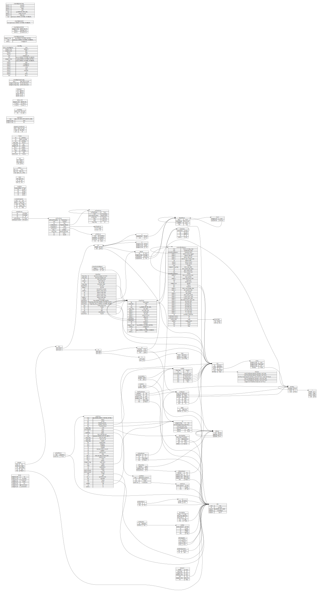

# 结构体关系图

## 功能
- [X] 从 C 源码提取结构提
- [X] 解析结构体关系
- [X] 解析链接
- [X] 根据结构体和链接绘制图片
- [ ] 避免名称冲突

## 提取结构体

```sh
cat *.h *.c| python3 ./extract_struct.py | sed -E  's/typedef *//' | sed -E 's/^}.*/};/' | sed -E '/\/\*/{:start /\*\//!{N;b start};s/\/\*.*\*\///}' | sed -E 's#/\*.*\*/##'  | sed -E '/^ *$/d' > struct.txt
```


## 结构体绘图

```sh
cat struct.txt | python3 ./generate_rel.py > tmpfile
dot -Tsvg tmpfile -o out.svg
```

## Redis 3.0.0 关系大图


