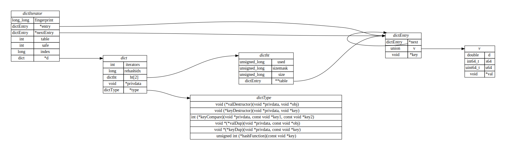

# 结构体关系图
## 项目地址
[zhoupro/structs_relation](https://github.com/zhoupro/structs_relation)


## 功能
- [X] 从 C 源码提取结构提
- [X] 解析结构体关系
- [X] 解析链接
- [X] 根据结构体和链接绘制图片
- [ ] 避免名称冲突

## Redis 3.0.0 关系大图
绘制Redis 3.0.0 结构体



## 提取结构体

```sh
cat *.h *.c| python3 ./extract_struct.py | sed -E  's/typedef *//' | sed -E 's/^}.*/};/' | sed -E '/\/\*/{:start /\*\//!{N;b start};s/\/\*.*\*\///}' | sed -E 's#/\*.*\*/##'  | sed -E '/^ *$/d' > struct.txt
```


## 结构体绘图

```sh
cat struct.txt | python3 ./generate_rel.py > tmpfile
dot -Tsvg tmpfile -o out.svg
```

## 参考
- [1, 用lex分析C源码中数据结构关系拓扑图](https://blog.csdn.net/peterbig/article/details/74614949)
- [2, 利用python+graphviz绘制数据结构关系图和指定目录下头文件 ](https://www.cnblogs.com/leituhaomo/p/11729449.html)
